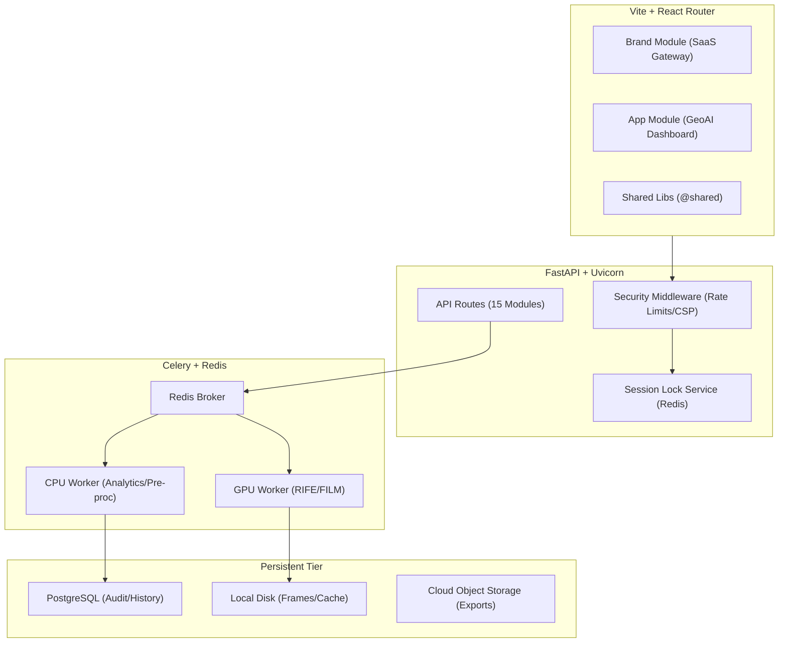

# AetherGIS v2.0 Architecture

This document provides a deep dive into the technical architecture of AetherGIS, focusing on the v2.0 "SaaS Overhaul" which introduced modular frontend segregation, hardware-exclusive queuing, and hybrid data ingestion.

## 1. System Overview

AetherGIS is designed as a **Modular Monolith** with a distributed task backend. It balances high-performance GeoAI processing (GPU-intensive) with a premium, low-latency user interface.

### 1.1 High-Level Block Diagram

---

## 2. Frontend: Modular Monolith

To support SaaS production and local academic demos simultaneously, we moved away from a flat structure to a strictly segregated modular architecture.

### 2.1 Directory Structure
- **`src/modules/brand/`**: Public-facing marketing assets. High SEO focus, cinematic animations, and legal documentation.
- **`src/modules/app/`**: The "Workhorse." Contains the GeoAI Dashboard, OpenLayers map engine, and real-time analysis tools.
- **`src/modules/shared/`**: Centralized logic, including the typed API client, Zod schemas, and reusable UI tokens.

### 2.2 Path Aliasing
We use Vite/TypeScript aliases to enforce boundaries:
- `@brand`: Restricted to landing/legal pages.
- `@app`: Restricted to the GeoAI Engine.
- `@shared`: Accessible by both.

---

## 3. The "King of the Hill" Queuing System

AetherGIS v2.0 solves the "GPU Contention" problem by implementing a strict session-locking mechanism.

### 3.1 Session Lock Logic
When a user visits `/dashboard`, the `SessionGate` component checks the Redis-backed lock:
1. **System Available**: User claims the lock (heartbeat starts). Dashboard unlocks.
2. **System Busy**: User is placed in a "Waiting Room" with a live WebSocket/Polling update on their queue position.

### 3.2 Heartbeat & Auto-Release
To prevent "Ghost Locks" (users closing the tab without logging out):
- The frontend sends a heartbeat every 30 seconds.
- Redis expires the lock if no heartbeat is received within 60 seconds.
- This ensures hardware is never stranded.

---

## 4. Hybrid Data Ingestion (Module 3)

Reliability is paramount. The ingestion engine follows a cascading fallback strategy:

1. **`LocalDiskProvider`**: Checks `backend/data/offline/` first. Essential for low-latency academic demos and offline replication.
2. **`NASA_GIBS_Provider`**: Primary cloud source for global MODIS/VIIRS data.
3. **`ISRO_Bhuvan_Provider` (Planned)**: Integration for high-resolution Indian subcontinent data via WMS.

---

## 5. Security & Production Hardening

In `production` mode, the system enables several enterprise-grade features:
- **HSTS (Strict-Transport-Security)**: Enforces HTTPS at the browser level.
- **CSP (Content Security Policy)**: Prevents XSS by restricting script execution and image sources.
- **Environment-Aware Rate Limiting**: Enabled in production to prevent API abuse, while remaining disabled in `development` for frictionless testing.

---

## 6. Model Registry (Module 5)

The system abstracts AI models into a standard registry. Currently supported:
- **RIFE (Real-Time Intermediate Flow Estimation)**: High-performance temporal enhancement.
- **FILM (Frame Interpolation for Large Motion)**: Better for rapid cloud/storm movement.
- **LK Fallback**: Classical Lucas-Kanade optical flow for low-resource environments.
